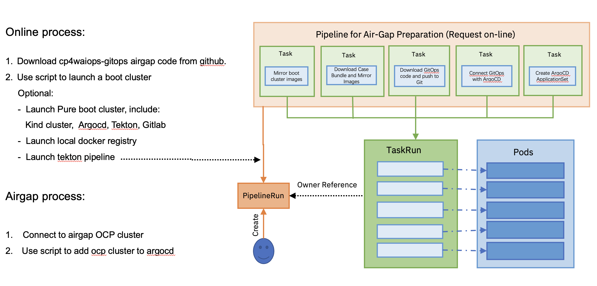
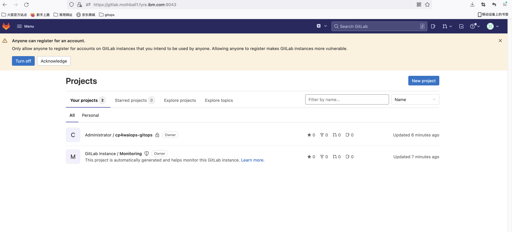
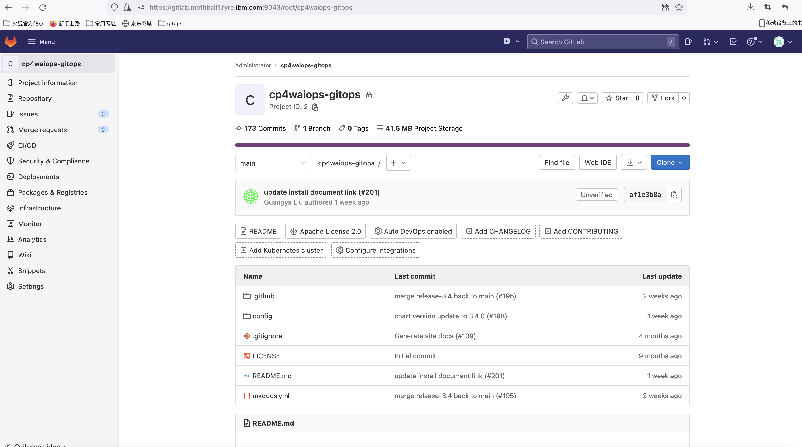
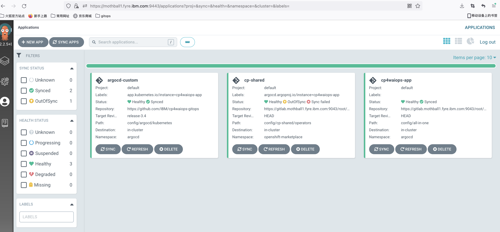
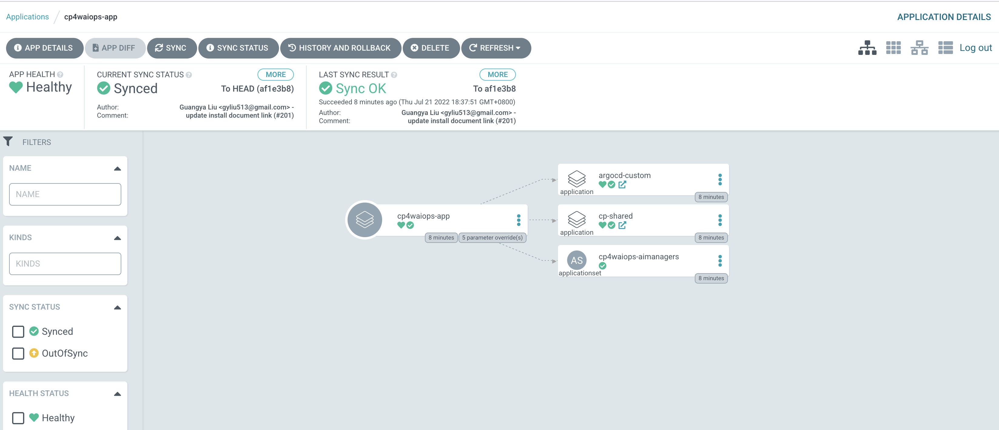
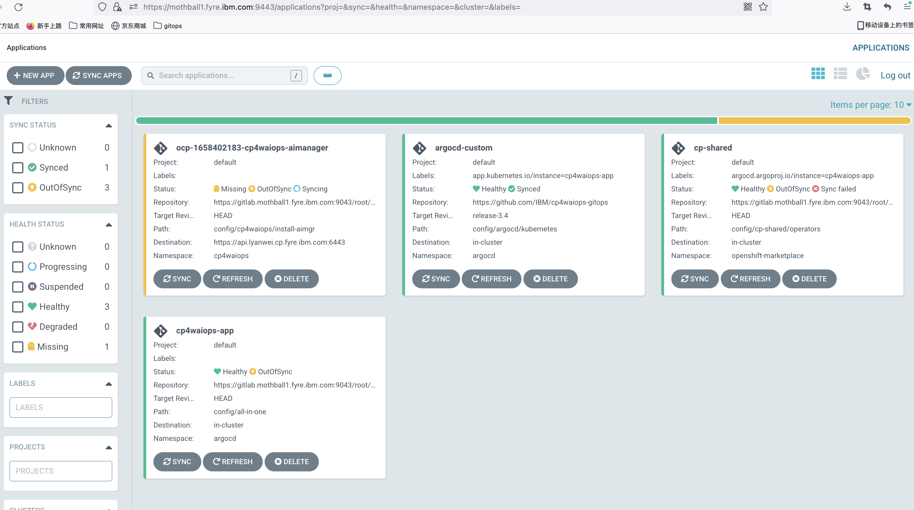
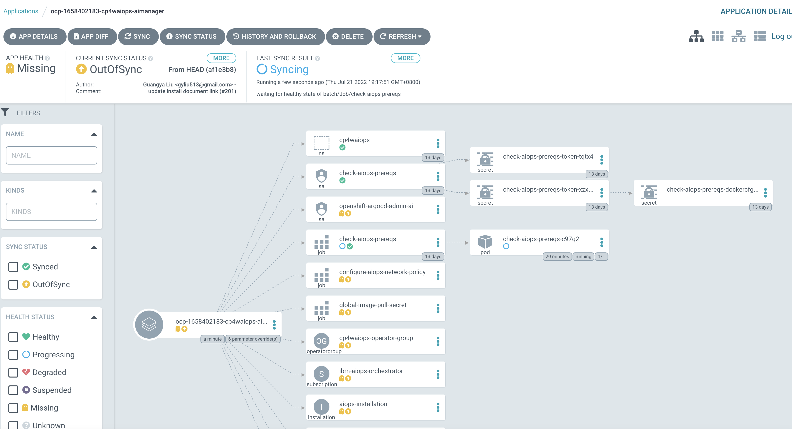

## Gitops airgap install



## Launch boot cluster (online)

Launch a boot cluster, include `kind cluster`, `argocd`, `tekton`, `gitlab`

```
./script/bootstrap.sh --launchBootCluster
```

Usage help:

```
--launchBootCluster                         # Launch a pure boot cluster, include `kind`, `argocd`, `tekton`, `gitlab`
--launchRegistry                            # Launch a local docker registry if you don't have one
--registry ${LOCAL_REGISTRY}                # Local docker registry, provide this if you have a local docker registry
--username ${USERNAME}                      # Local docker registry username, provide this if you have a local docker registry
--password ${PASSWORD}                      # Local docker registry password, provide this if you have a local docker registry
--cpToken ${CPTOKEN}                        # cp.icr.io registry token
--storageClass ${STORAGE_CALSS}             # storage class of your target OCP cluster, default is rook-cephfs
--aiopsCase ${aiopsCase}                    # Case bundle name, default is ibm-cp-waiops
--aiopsCaseVersoin ${aiopsCaseVersoin}      # Case bundle version, default is 1.3.0

Optional:
--gitRepo ${GITREPO}                        # Git repo name, provide this if you want to use your own git server
--gitUsername ${GITUSERNAME}                # Git repo username, provide this if you want to use your own git server
--gitPassword ${GITPASSWORD}                # Git repo password, provide this if you want to use your own git server
--argocdUrl ${ARGOCD_URL}                   # ArgoCD server, provide this if you want to use your own argocd server
--argocdUsername ${ARGOCD_USERNAME}         # ArgoCD login username, provide this if you want to use your own argocd server
--argocdPassword ${ARGOCD_PASSWORD}         # ArgoCD login password, provide this if you want to use your own argocd server
```

For example:

- Launch a boot cluster, include a `local docker registry`, `argocd`, `tekton`, `gitlab`.
- Launch a tekton pipeline, include `aiops image mirror`, `bootcluster image mirror`, `push gitops code to gitlab`, `connect argocd and gitlab repo`, `install argocd applicationset`

```
./script/bootstrap.sh --launchBootCluster --launchRegistry --cpToken ${CPTOKEN} --aiopsCase ibm-cp-waiops --aiopsCaseVersoin 1.3.0 --storageClass ${STORAGE_CALSS}
```

Ootput:
```
[INFO] Launch local container registry ...
-----------------------------------------------------------------------
...+......+.+.........+..+..........+.........+........+.+..+++++++++++++++++++++++++++++++++++++++++++++++++++++++++++++++++*.....+.+........+.+.................+....+.....+......+..........+...+..+.........+......+...................+......+..+.......+......+.....+...+.+...+..+......+.......+..+.........+.......+..............+++++++++++++++++++++++++++++++++++++++++++++++++++++++++++++++++*........+.....+......+...............+.+.....+......+....+...+.....+......+............+.............+......+........+.+.....................+...+......+......+...........+.......+........+......................+..+.+..............+......+..........+.........+........+.......+.....+......+...+............+.............+.........+..+...+...+.........+................+..+...+....+.........+.....+.+..................+..+...+......+...............+..........+.........+...........+....+...........................+.........+..+....+.....+......+......................+..+...+...+.........+...+......+.....................................+.....+.......+..+.+.....+...+......+.+..................+.........+...........+.+......+++++++++++++++++++++++++++++++++++++++++++++++++++++++++++++++++
-----
Unable to find image 'registry:2' locally
2: Pulling from library/registry
530afca65e2e: Pull complete
d450d4da0343: Pull complete
96277bea17b6: Pull complete
470ad04e03fb: Pull complete
bd3d4dc6e66f: Pull complete
Digest: sha256:c631a581c6152f5a4a141a974b74cf308ab2ee660287a3c749d88e0b536c0c20
Status: Downloaded newer image for registry:2
1b28c2dfe045f65187072a9a433375c542b44b6e05a1c5ba373483e05412f639
/root/cp4waiops-gitops/airgap
[INFO] Launch local container registry mothball1.fyre.ibm.com:5003...
[INFO] Copy image data in ~/.ibm-pak/data/registry/data
-------------Launch Boot Cluster-------------
INFO  Installing kubectl v1.17.11 ...
INFO  Installing kubectl v1.17.11 ... OK
INFO  Installing kind v0.11.1 ...
INFO  Installing kind v0.11.1 ... OK
INFO  kind up ...
Creating cluster "gitops-sandbox" ...
 ✓ Ensuring node image (kindest/node:v1.21.2) 🖼
 ✓ Preparing nodes 📦
 ✓ Writing configuration 📜
 ✓ Starting control-plane 🕹️
 ✓ Installing CNI 🔌
 ✓ Installing StorageClass 💾
Set kubectl context to "kind-gitops-sandbox"
You can now use your cluster with:

kubectl cluster-info --context kind-gitops-sandbox

Not sure what to do next? 😅  Check out https://kind.sigs.k8s.io/docs/user/quick-start/
INFO  kind up ... OK
INFO  Installing Argo CD v2.2.5 ...
namespace/argocd created
customresourcedefinition.apiextensions.k8s.io/applications.argoproj.io created
customresourcedefinition.apiextensions.k8s.io/appprojects.argoproj.io created
serviceaccount/argocd-application-controller created
serviceaccount/argocd-dex-server created
serviceaccount/argocd-redis created
serviceaccount/argocd-server created
role.rbac.authorization.k8s.io/argocd-application-controller created
role.rbac.authorization.k8s.io/argocd-dex-server created
role.rbac.authorization.k8s.io/argocd-server created
clusterrole.rbac.authorization.k8s.io/argocd-application-controller created
clusterrole.rbac.authorization.k8s.io/argocd-server created
rolebinding.rbac.authorization.k8s.io/argocd-application-controller created
rolebinding.rbac.authorization.k8s.io/argocd-dex-server created
rolebinding.rbac.authorization.k8s.io/argocd-redis created
rolebinding.rbac.authorization.k8s.io/argocd-server created
clusterrolebinding.rbac.authorization.k8s.io/argocd-application-controller created
clusterrolebinding.rbac.authorization.k8s.io/argocd-server created
configmap/argocd-cm created
configmap/argocd-cmd-params-cm created
configmap/argocd-gpg-keys-cm created
configmap/argocd-rbac-cm created
configmap/argocd-ssh-known-hosts-cm created
configmap/argocd-tls-certs-cm created
secret/argocd-secret created
service/argocd-dex-server created
service/argocd-metrics created
service/argocd-redis created
service/argocd-repo-server created
service/argocd-server created
service/argocd-server-metrics created
deployment.apps/argocd-dex-server created
deployment.apps/argocd-redis created
deployment.apps/argocd-repo-server created
deployment.apps/argocd-server created
statefulset.apps/argocd-application-controller created
networkpolicy.networking.k8s.io/argocd-application-controller-network-policy created
networkpolicy.networking.k8s.io/argocd-dex-server-network-policy created
networkpolicy.networking.k8s.io/argocd-redis-network-policy created
networkpolicy.networking.k8s.io/argocd-repo-server-network-policy created
networkpolicy.networking.k8s.io/argocd-server-network-policy created
customresourcedefinition.apiextensions.k8s.io/applicationsets.argoproj.io created
serviceaccount/argocd-applicationset-controller created
role.rbac.authorization.k8s.io/argocd-applicationset-controller created
rolebinding.rbac.authorization.k8s.io/argocd-applicationset-controller created
service/argocd-applicationset-controller created
deployment.apps/argocd-applicationset-controller created
Waiting for deployment argocd-server in argocd namespace ready ..................................................... Done
service/argocd-server patched
Waiting for deployment argocd-applicationset-controller in argocd namespace ready . Done
INFO  Installing Argo CD v2.2.5 ... OK
INFO  Installing Argo CD CLI v2.2.5 ...
INFO  Installing Argo CD CLI v2.2.5 ... OK
INFO  Installing KubeSeal CLI v0.16.0 ...
INFO  Installing KubeSeal CLI v0.16.0 ... OK
INFO  Installing Tekton v0.35.0 ...
namespace/tekton-pipelines created
podsecuritypolicy.policy/tekton-pipelines created
clusterrole.rbac.authorization.k8s.io/tekton-pipelines-controller-cluster-access created
clusterrole.rbac.authorization.k8s.io/tekton-pipelines-controller-tenant-access created
clusterrole.rbac.authorization.k8s.io/tekton-pipelines-webhook-cluster-access created
role.rbac.authorization.k8s.io/tekton-pipelines-controller created
role.rbac.authorization.k8s.io/tekton-pipelines-webhook created
role.rbac.authorization.k8s.io/tekton-pipelines-leader-election created
role.rbac.authorization.k8s.io/tekton-pipelines-info created
serviceaccount/tekton-pipelines-controller created
serviceaccount/tekton-pipelines-webhook created
clusterrolebinding.rbac.authorization.k8s.io/tekton-pipelines-controller-cluster-access created
clusterrolebinding.rbac.authorization.k8s.io/tekton-pipelines-controller-tenant-access created
clusterrolebinding.rbac.authorization.k8s.io/tekton-pipelines-webhook-cluster-access created
rolebinding.rbac.authorization.k8s.io/tekton-pipelines-controller created
rolebinding.rbac.authorization.k8s.io/tekton-pipelines-webhook created
rolebinding.rbac.authorization.k8s.io/tekton-pipelines-controller-leaderelection created
rolebinding.rbac.authorization.k8s.io/tekton-pipelines-webhook-leaderelection created
rolebinding.rbac.authorization.k8s.io/tekton-pipelines-info created
customresourcedefinition.apiextensions.k8s.io/clustertasks.tekton.dev created
customresourcedefinition.apiextensions.k8s.io/conditions.tekton.dev created
customresourcedefinition.apiextensions.k8s.io/pipelines.tekton.dev created
customresourcedefinition.apiextensions.k8s.io/pipelineruns.tekton.dev created
customresourcedefinition.apiextensions.k8s.io/resolutionrequests.resolution.tekton.dev created
customresourcedefinition.apiextensions.k8s.io/pipelineresources.tekton.dev created
customresourcedefinition.apiextensions.k8s.io/runs.tekton.dev created
customresourcedefinition.apiextensions.k8s.io/tasks.tekton.dev created
customresourcedefinition.apiextensions.k8s.io/taskruns.tekton.dev created
secret/webhook-certs created
validatingwebhookconfiguration.admissionregistration.k8s.io/validation.webhook.pipeline.tekton.dev created
mutatingwebhookconfiguration.admissionregistration.k8s.io/webhook.pipeline.tekton.dev created
validatingwebhookconfiguration.admissionregistration.k8s.io/config.webhook.pipeline.tekton.dev created
clusterrole.rbac.authorization.k8s.io/tekton-aggregate-edit created
clusterrole.rbac.authorization.k8s.io/tekton-aggregate-view created
configmap/config-artifact-bucket created
configmap/config-artifact-pvc created
configmap/config-defaults created
configmap/feature-flags created
configmap/pipelines-info created
configmap/config-leader-election created
configmap/config-logging created
configmap/config-observability created
configmap/config-registry-cert created
deployment.apps/tekton-pipelines-controller created
service/tekton-pipelines-controller created
horizontalpodautoscaler.autoscaling/tekton-pipelines-webhook created
deployment.apps/tekton-pipelines-webhook created
service/tekton-pipelines-webhook created
customresourcedefinition.apiextensions.k8s.io/extensions.dashboard.tekton.dev created
serviceaccount/tekton-dashboard created
role.rbac.authorization.k8s.io/tekton-dashboard-info created
clusterrole.rbac.authorization.k8s.io/tekton-dashboard-backend created
clusterrole.rbac.authorization.k8s.io/tekton-dashboard-tenant created
rolebinding.rbac.authorization.k8s.io/tekton-dashboard-info created
clusterrolebinding.rbac.authorization.k8s.io/tekton-dashboard-backend created
configmap/dashboard-info created
service/tekton-dashboard created
deployment.apps/tekton-dashboard created
clusterrolebinding.rbac.authorization.k8s.io/tekton-dashboard-tenant created
service/tekton-dashboard patched
Waiting for deployment tekton-pipelines-controller in tekton-pipelines namespace ready .......... Done
Waiting for deployment tekton-pipelines-webhook in tekton-pipelines namespace ready .......... Done
Waiting for deployment tekton-dashboard in tekton-pipelines namespace ready . Done
configmap/feature-flags patched
task.tekton.dev/git-clone created
task.tekton.dev/ansible-runner created
INFO  Installing Tekton v0.35.0 ... OK
INFO  Installing Tekton CLI v0.23.1 ...
LICENSE
README.md
tkn
INFO  Installing TEKTON CLI v0.23.1 ... OK
INFO  Installing Helm v3.9.0 ...
linux-amd64/
linux-amd64/helm
linux-amd64/LICENSE
linux-amd64/README.md
INFO  Installing Helm CLI v3.9.0 ... OK
INFO  Installing Gitlab ...
-------------Installing Gitlab-------------
namespace/gitlab created
"gitlab" has been added to your repositories
Hang tight while we grab the latest from your chart repositories...
...Successfully got an update from the "gitlab" chart repository
Update Complete. ⎈Happy Helming!⎈
Release "gitlab" does not exist. Installing it now.
NAME: gitlab
LAST DEPLOYED: Thu Jul 21 03:33:27 2022
NAMESPACE: gitlab
STATUS: deployed
REVISION: 1
NOTES:
NOTICE: The minimum required version of PostgreSQL is now 12. See https://gitlab.com/gitlab-org/charts/gitlab/-/blob/master/doc/installation/upgrade.md for more details.

Help us improve the installation experience, let us know how we did with a 1 minute survey:
https://gitlab.fra1.qualtrics.com/jfe/form/SV_6kVqZANThUQ1bZb?installation=helm&release=15-1

NOTICE: The in-chart NGINX Ingress Controller has the following requirements:
    - Kubernetes version must be 1.19 or newer.
    - Ingress objects must be in group/version `networking.k8s.io/v1`.
service/gitlab-nginx-ingress-controller patched
Waiting for deployment gitlab-webservice-default in gitlab namespace ready ................................................................................................................................... Done
INFO  Installing Gitlab https://gitlab.mothball1.fyre.ibm.com:9043 ... OK

👏 Congratulations! The GitOps demo environment is available!
It launched a kind cluster, installed following tools and applitions:
- kind v0.11.1
- kubectl v1.17.11
- argocd v2.2.5
- argocd cli v2.2.5
- kubeseal cli v0.16.0
- tekton v0.35.0
- tekton dashboard v0.25.0
- tekton cli v0.23.1
- helm v3.9.0
To access Argo CD UI, open https://mothball1.fyre.ibm.com:9443 in browser.
- username: admin
- password: evpRN9jf2anczh26

To access Gitlab UI, open https://gitlab.mothball1.fyre.ibm.com:9043 in browser.
- username: root
- password: qArPjKnrU6q62tcj9WB6Y6ywaxiBxOYDycRPwjMrlyRKt4AnATZFkWbhlJaKbdp1

To access Tekton Dashboard UI, open http://mothball1.fyre.ibm.com:9097 in browser.


WARNING: server certificate had error: x509: certificate is valid for localhost, argocd-server, argocd-server.argocd, argocd-server.argocd.svc, argocd-server.argocd.svc.cluster.local, not mothball1.fyre.ibm.com. Proceed insecurely (y/n)? 'admin:login' logged in successfully
Context 'mothball1.fyre.ibm.com:9443' updated
done
-------------Launch Pipeline to mirror image-------------
pipeline.tekton.dev/gitops-install-online-task created
task.tekton.dev/aiops-mirror-image created
task.tekton.dev/pre-airgap-install created
task.tekton.dev/argocd-gitlab-connect created
task.tekton.dev/bootcluster-mirror-image created
task.tekton.dev/applicationset-install created
task.tekton.dev/push-code-to-git created
serviceaccount/tekton-pipeline created
clusterrolebinding.rbac.authorization.k8s.io/tekton-pipeline created
secret/gitops-install-env-secret created
pipelinerun.tekton.dev/online-task created
done
```

- Gitlab UI: 



- cp4waiops-gitops repo in Gitlab:



- Tekton UI: five tasks running, `aiops image mirror`, `bootcluster image mirror`, `push gitops code to gitlab`, `connect argocd and gitlab repo`, `install argocd applicationset`


- ArgoCD UI: after tekton task `install argocd applicationset` finished, we can see Argocd applicationset has been deployed.





## Add cluster to argocd (airgap)

```
oc login

./script/bootstrap.sh --addCluster --registry ${LOCAL_REGISTRY} --username ${USERNAME} --password {PASSWORD}
```

For example:

```
./script/bootstrap.sh --addCluster --registry mothball1.fyre.ibm.com:5003 --username admin --password admin
```

Ootput:
```
-------------Create ImageContentSourcePolicy-------------
imagecontentsourcepolicy.operator.openshift.io/ibm-cp-waiops created
-------------Patch insecureRegistries-------------
image.config.openshift.io/cluster patched
-------------Configuring cluster pullsecret-------------
/root/.dockerconfigjson
Saved credentials for mothball1.fyre.ibm.com:5003
secret/pull-secret data updated
-------------Add Cluster to Argocd-------------
WARNING: This will create a service account `argocd-manager` on the cluster referenced by context `default/api-lyanwei-cp-fyre-ibm-com:6443/kube:admin` with full cluster level admin privileges. Do you want to continue [y/N]? INFO[0000] ServiceAccount "argocd-manager" created
INFO[0000] ClusterRole "argocd-manager-role" created
INFO[0000] ClusterRoleBinding "argocd-manager-role-binding" created
Cluster 'https://api.lyanwei.cp.fyre.ibm.com:6443' added
done
```

On ArgoCD UI, we can see a new application has been created to deploy, the destination is target OCP cluster.



CP4WAIOps has been deployed on the target cluster.


