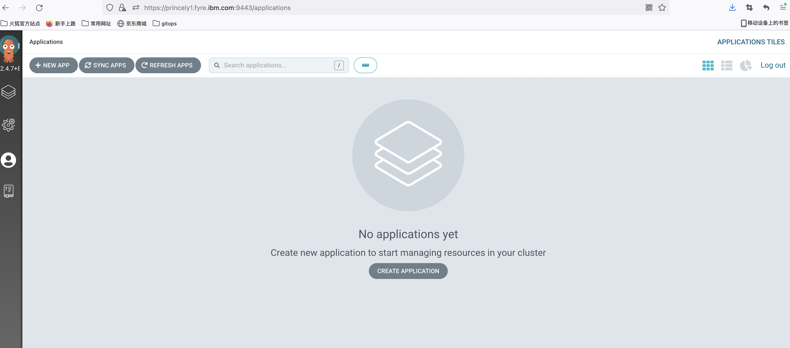
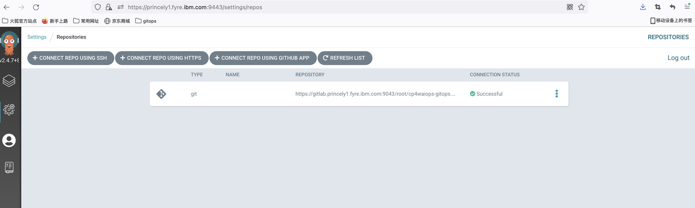

<!-- START doctoc generated TOC please keep comment here to allow auto update -->
<!-- DON'T EDIT THIS SECTION, INSTEAD RE-RUN doctoc TO UPDATE -->
**Table of Contents**  *generated with [DocToc](https://github.com/thlorenz/doctoc)*

- [Gitops airgap install](#gitops-airgap-install)
  - [Launch boot cluster](#launch-boot-cluster)
    - [Prerequisites](#prerequisites)
    - [Bastion host & Portable compute device (online)](#bastion-host--portable-compute-device-online)
    - [Portable storage device](#portable-storage-device)
      - [1.Launch boot cluster preparation (online)](#1launch-boot-cluster-preparation-online)
      - [2.Copy saved offline data](#2copy-saved-offline-data)
      - [3.Launch boot cluster in an airgap environment (airgap)](#3launch-boot-cluster-in-an-airgap-environment-airgap)
  - [Add airgap OCP cluster to argocd (airgap)](#add-airgap-ocp-cluster-to-argocd-airgap)
  - [CP4WAIOps Gitops Install](#cp4waiops-gitops-install)
    - [Mirror image](#mirror-image)
    - [Gitops Install (airgap)](#gitops-install-airgap)

<!-- END doctoc generated TOC please keep comment here to allow auto update -->

# Gitops airgap install

## Launch boot cluster

### Prerequisites

- docker
- oc

### Bastion host & Portable compute device (online)

Launch a boot cluster, include `kind cluster`, `argocd`, `tekton`, `gitlab`

```
./script/bootstrap.sh --launchBootCluster --launchRegistry
```

Usage help:

```
--launchBootCluster                         # Launch a pure boot cluster, include `kind`, `argocd`, `tekton`, `gitlab`
--launchRegistry                            # Launch a local docker registry if you don't have one
--registry ${LOCAL_REGISTRY}                # Local docker registry, provide this if you have a local docker registry
--username ${USERNAME}                      # Local docker registry username, provide this if you have a local docker registry
--password ${PASSWORD}                      # Local docker registry password, provide this if you have a local docker registry
```

For example:

- Launch a boot cluster, include a `local docker registry`, `argocd`, `tekton`, `gitlab`.
- Launch a tekton pipeline, include `gitops image mirror`, `push gitops code to gitlab`, `connect argocd and gitlab repo`

Output:
```
[INFO] Launch local container registry ...
-----------------------------------------------------------------------
...+......+.+.........+..+..........+.........+........+.+..+++++++++++++++++++++++++++++++++++++++++++++++++++++++++++++++++*.....+.+........+.+.................+....+.....+......+..........+...+..+.........+......+...................+......+..+.......+......+.....+...+.+...+..+......+.......+..+.........+.......+..............+++++++++++++++++++++++++++++++++++++++++++++++++++++++++++++++++*........+.....+......+...............+.+.....+......+....+...+.....+......+............+.............+......+........+.+.....................+...+......+......+...........+.......+........+......................+..+.+..............+......+..........+.........+........+.......+.....+......+...+............+.............+.........+..+...+...+.........+................+..+...+....+.........+.....+.+..................+..+...+......+...............+..........+.........+...........+....+...........................+.........+..+....+.....+......+......................+..+...+...+.........+...+......+.....................................+.....+.......+..+.+.....+...+......+.+..................+.........+...........+.+......+++++++++++++++++++++++++++++++++++++++++++++++++++++++++++++++++
-----
Unable to find image 'registry:2' locally
2: Pulling from library/registry
530afca65e2e: Pull complete
d450d4da0343: Pull complete
96277bea17b6: Pull complete
470ad04e03fb: Pull complete
bd3d4dc6e66f: Pull complete
Digest: sha256:c631a581c6152f5a4a141a974b74cf308ab2ee660287a3c749d88e0b536c0c20
Status: Downloaded newer image for registry:2
1b28c2dfe045f65187072a9a433375c542b44b6e05a1c5ba373483e05412f639
/root/cp4waiops-gitops/airgap
[INFO] Launch local container registry mothball1.fyre.ibm.com:5003...
[INFO] Copy image data in ~/.ibm-pak/data/registry/data
-------------Launch Boot Cluster-------------
INFO  Installing kubectl v1.17.11 ...
INFO  Installing kubectl v1.17.11 ... OK
INFO  Installing kind v0.11.1 ...
INFO  Installing kind v0.11.1 ... OK
INFO  kind up ...
Creating cluster "gitops-sandbox" ...
 ✓ Ensuring node image (kindest/node:v1.21.2) 🖼
 ✓ Preparing nodes 📦
 ✓ Writing configuration 📜
 ✓ Starting control-plane 🕹️
 ✓ Installing CNI 🔌
 ✓ Installing StorageClass 💾
Set kubectl context to "kind-gitops-sandbox"
You can now use your cluster with:

kubectl cluster-info --context kind-gitops-sandbox

Not sure what to do next? 😅  Check out https://kind.sigs.k8s.io/docs/user/quick-start/
INFO  kind up ... OK
INFO  Installing Argo CD v2.2.5 ...
namespace/argocd created
customresourcedefinition.apiextensions.k8s.io/applications.argoproj.io created
customresourcedefinition.apiextensions.k8s.io/appprojects.argoproj.io created
serviceaccount/argocd-application-controller created
serviceaccount/argocd-dex-server created
serviceaccount/argocd-redis created
serviceaccount/argocd-server created
role.rbac.authorization.k8s.io/argocd-application-controller created
role.rbac.authorization.k8s.io/argocd-dex-server created
role.rbac.authorization.k8s.io/argocd-server created
clusterrole.rbac.authorization.k8s.io/argocd-application-controller created
clusterrole.rbac.authorization.k8s.io/argocd-server created
rolebinding.rbac.authorization.k8s.io/argocd-application-controller created
rolebinding.rbac.authorization.k8s.io/argocd-dex-server created
rolebinding.rbac.authorization.k8s.io/argocd-redis created
rolebinding.rbac.authorization.k8s.io/argocd-server created
clusterrolebinding.rbac.authorization.k8s.io/argocd-application-controller created
clusterrolebinding.rbac.authorization.k8s.io/argocd-server created
configmap/argocd-cm created
configmap/argocd-cmd-params-cm created
configmap/argocd-gpg-keys-cm created
configmap/argocd-rbac-cm created
configmap/argocd-ssh-known-hosts-cm created
configmap/argocd-tls-certs-cm created
secret/argocd-secret created
service/argocd-dex-server created
service/argocd-metrics created
service/argocd-redis created
service/argocd-repo-server created
service/argocd-server created
service/argocd-server-metrics created
deployment.apps/argocd-dex-server created
deployment.apps/argocd-redis created
deployment.apps/argocd-repo-server created
deployment.apps/argocd-server created
statefulset.apps/argocd-application-controller created
networkpolicy.networking.k8s.io/argocd-application-controller-network-policy created
networkpolicy.networking.k8s.io/argocd-dex-server-network-policy created
networkpolicy.networking.k8s.io/argocd-redis-network-policy created
networkpolicy.networking.k8s.io/argocd-repo-server-network-policy created
networkpolicy.networking.k8s.io/argocd-server-network-policy created
customresourcedefinition.apiextensions.k8s.io/applicationsets.argoproj.io created
serviceaccount/argocd-applicationset-controller created
role.rbac.authorization.k8s.io/argocd-applicationset-controller created
rolebinding.rbac.authorization.k8s.io/argocd-applicationset-controller created
service/argocd-applicationset-controller created
deployment.apps/argocd-applicationset-controller created
Waiting for deployment argocd-server in argocd namespace ready ..................................................... Done
service/argocd-server patched
Waiting for deployment argocd-applicationset-controller in argocd namespace ready . Done
INFO  Installing Argo CD v2.2.5 ... OK
INFO  Installing Argo CD CLI v2.2.5 ...
INFO  Installing Argo CD CLI v2.2.5 ... OK
INFO  Installing KubeSeal CLI v0.16.0 ...
INFO  Installing KubeSeal CLI v0.16.0 ... OK
INFO  Installing Tekton v0.35.0 ...
namespace/tekton-pipelines created
podsecuritypolicy.policy/tekton-pipelines created
clusterrole.rbac.authorization.k8s.io/tekton-pipelines-controller-cluster-access created
clusterrole.rbac.authorization.k8s.io/tekton-pipelines-controller-tenant-access created
clusterrole.rbac.authorization.k8s.io/tekton-pipelines-webhook-cluster-access created
role.rbac.authorization.k8s.io/tekton-pipelines-controller created
role.rbac.authorization.k8s.io/tekton-pipelines-webhook created
role.rbac.authorization.k8s.io/tekton-pipelines-leader-election created
role.rbac.authorization.k8s.io/tekton-pipelines-info created
serviceaccount/tekton-pipelines-controller created
serviceaccount/tekton-pipelines-webhook created
clusterrolebinding.rbac.authorization.k8s.io/tekton-pipelines-controller-cluster-access created
clusterrolebinding.rbac.authorization.k8s.io/tekton-pipelines-controller-tenant-access created
clusterrolebinding.rbac.authorization.k8s.io/tekton-pipelines-webhook-cluster-access created
rolebinding.rbac.authorization.k8s.io/tekton-pipelines-controller created
rolebinding.rbac.authorization.k8s.io/tekton-pipelines-webhook created
rolebinding.rbac.authorization.k8s.io/tekton-pipelines-controller-leaderelection created
rolebinding.rbac.authorization.k8s.io/tekton-pipelines-webhook-leaderelection created
rolebinding.rbac.authorization.k8s.io/tekton-pipelines-info created
customresourcedefinition.apiextensions.k8s.io/clustertasks.tekton.dev created
customresourcedefinition.apiextensions.k8s.io/conditions.tekton.dev created
customresourcedefinition.apiextensions.k8s.io/pipelines.tekton.dev created
customresourcedefinition.apiextensions.k8s.io/pipelineruns.tekton.dev created
customresourcedefinition.apiextensions.k8s.io/resolutionrequests.resolution.tekton.dev created
customresourcedefinition.apiextensions.k8s.io/pipelineresources.tekton.dev created
customresourcedefinition.apiextensions.k8s.io/runs.tekton.dev created
customresourcedefinition.apiextensions.k8s.io/tasks.tekton.dev created
customresourcedefinition.apiextensions.k8s.io/taskruns.tekton.dev created
secret/webhook-certs created
validatingwebhookconfiguration.admissionregistration.k8s.io/validation.webhook.pipeline.tekton.dev created
mutatingwebhookconfiguration.admissionregistration.k8s.io/webhook.pipeline.tekton.dev created
validatingwebhookconfiguration.admissionregistration.k8s.io/config.webhook.pipeline.tekton.dev created
clusterrole.rbac.authorization.k8s.io/tekton-aggregate-edit created
clusterrole.rbac.authorization.k8s.io/tekton-aggregate-view created
configmap/config-artifact-bucket created
configmap/config-artifact-pvc created
configmap/config-defaults created
configmap/feature-flags created
configmap/pipelines-info created
configmap/config-leader-election created
configmap/config-logging created
configmap/config-observability created
configmap/config-registry-cert created
deployment.apps/tekton-pipelines-controller created
service/tekton-pipelines-controller created
horizontalpodautoscaler.autoscaling/tekton-pipelines-webhook created
deployment.apps/tekton-pipelines-webhook created
service/tekton-pipelines-webhook created
customresourcedefinition.apiextensions.k8s.io/extensions.dashboard.tekton.dev created
serviceaccount/tekton-dashboard created
role.rbac.authorization.k8s.io/tekton-dashboard-info created
clusterrole.rbac.authorization.k8s.io/tekton-dashboard-backend created
clusterrole.rbac.authorization.k8s.io/tekton-dashboard-tenant created
rolebinding.rbac.authorization.k8s.io/tekton-dashboard-info created
clusterrolebinding.rbac.authorization.k8s.io/tekton-dashboard-backend created
configmap/dashboard-info created
service/tekton-dashboard created
deployment.apps/tekton-dashboard created
clusterrolebinding.rbac.authorization.k8s.io/tekton-dashboard-tenant created
service/tekton-dashboard patched
Waiting for deployment tekton-pipelines-controller in tekton-pipelines namespace ready .......... Done
Waiting for deployment tekton-pipelines-webhook in tekton-pipelines namespace ready .......... Done
Waiting for deployment tekton-dashboard in tekton-pipelines namespace ready . Done
configmap/feature-flags patched
task.tekton.dev/git-clone created
task.tekton.dev/ansible-runner created
INFO  Installing Tekton v0.35.0 ... OK
INFO  Installing Tekton CLI v0.23.1 ...
LICENSE
README.md
tkn
INFO  Installing TEKTON CLI v0.23.1 ... OK
INFO  Installing Helm v3.9.0 ...
linux-amd64/
linux-amd64/helm
linux-amd64/LICENSE
linux-amd64/README.md
INFO  Installing Helm CLI v3.9.0 ... OK
INFO  Installing Gitlab ...
-------------Installing Gitlab-------------
namespace/gitlab created
"gitlab" has been added to your repositories
Hang tight while we grab the latest from your chart repositories...
...Successfully got an update from the "gitlab" chart repository
Update Complete. ⎈Happy Helming!⎈
Release "gitlab" does not exist. Installing it now.
NAME: gitlab
LAST DEPLOYED: Thu Jul 21 03:33:27 2022
NAMESPACE: gitlab
STATUS: deployed
REVISION: 1
NOTES:
NOTICE: The minimum required version of PostgreSQL is now 12. See https://gitlab.com/gitlab-org/charts/gitlab/-/blob/master/doc/installation/upgrade.md for more details.

Help us improve the installation experience, let us know how we did with a 1 minute survey:
https://gitlab.fra1.qualtrics.com/jfe/form/SV_6kVqZANThUQ1bZb?installation=helm&release=15-1

NOTICE: The in-chart NGINX Ingress Controller has the following requirements:
    - Kubernetes version must be 1.19 or newer.
    - Ingress objects must be in group/version `networking.k8s.io/v1`.
service/gitlab-nginx-ingress-controller patched
Waiting for deployment gitlab-webservice-default in gitlab namespace ready ................................................................................................................................... Done
INFO  Installing Gitlab https://gitlab.mothball1.fyre.ibm.com:9043 ... OK

👏 Congratulations! The GitOps demo environment is available!
It launched a kind cluster, installed following tools and applitions:
- kind v0.11.1
- kubectl v1.17.11
- argocd v2.2.5
- argocd cli v2.2.5
- kubeseal cli v0.16.0
- tekton v0.35.0
- tekton dashboard v0.25.0
- tekton cli v0.23.1
- helm v3.9.0
To access Argo CD UI, open https://mothball1.fyre.ibm.com:9443 in browser.
- username: admin
- password: evpRN9jf2anczh26

To access Gitlab UI, open https://gitlab.mothball1.fyre.ibm.com:9043 in browser.
- username: root
- password: qArPjKnrU6q62tcj9WB6Y6ywaxiBxOYDycRPwjMrlyRKt4AnATZFkWbhlJaKbdp1

To access Tekton Dashboard UI, open http://mothball1.fyre.ibm.com:9097 in browser.


WARNING: server certificate had error: x509: certificate is valid for localhost, argocd-server, argocd-server.argocd, argocd-server.argocd.svc, argocd-server.argocd.svc.cluster.local, not mothball1.fyre.ibm.com. Proceed insecurely (y/n)? 'admin:login' logged in successfully
Context 'mothball1.fyre.ibm.com:9443' updated
done
-------------Launch Tekton Pipeline-------------
secret/gitops-install-env-secret created
pipeline.tekton.dev/aiops-mirror-image created
pipeline.tekton.dev/aiops-mirror-image-filesystem created
pipeline.tekton.dev/bootcluster-mirror-image-filesystem created
pipeline.tekton.dev/gitops-install-online-task created
task.tekton.dev/aiops-mirror-image-filesystem created
task.tekton.dev/aiops-mirror-image created
task.tekton.dev/pre-airgap-install created
task.tekton.dev/argocd-gitlab-connect created
task.tekton.dev/bootcluster-mirror-image-filesystem created
task.tekton.dev/bootcluster-mirror-image created
task.tekton.dev/applicationset-install created
task.tekton.dev/push-code-to-git created
serviceaccount/tekton-pipeline created
clusterrolebinding.rbac.authorization.k8s.io/tekton-pipeline created
task.tekton.dev/wait-image-copy created
done
-------------Launch Bootcluster Online Pipeline-------------
Error from server (NotFound): pipelineruns.tekton.dev "bc-online" not found
persistentvolumeclaim/bc-image created
pipelinerun.tekton.dev/bc-online created
done
```

### Portable storage device

#### 1.Launch boot cluster preparation (online)

- Mirror images of `kind cluster`, `argocd`, `tekton`, `gitlab`
- Download CLI `kubectl`, `argocd`, `tekton`, `helm`

```
./script/bootstrap.sh --preLaunchBootCluster --launchRegistry 
```

Usage help:

```
--preLaunchBootCluster    # Prepare boot cluster images and CLI
--launchRegistry          # Launch a local docker registry
```

Output:

```
-------------Prepare Airgap Launch Boot Cluster-------------
INFO  Installing kubectl v1.17.11 ...
kubectl v1.17.11 detected.
INFO  Installing kubectl v1.17.11 ... OK
INFO  Installing kind v0.11.1 ...
kind v0.11.1 detected.
INFO  Installing kind v0.11.1 ... OK
INFO  kind up ...
Creating cluster "gitops-sandbox" ...
 ✓ Ensuring node image (kindest/node:v1.21.2) 🖼
 ✓ Preparing nodes 📦
 ✓ Writing configuration 📜
 ✓ Starting control-plane 🕹️
 ✓ Installing CNI 🔌
 ✓ Installing StorageClass 💾
Set kubectl context to "kind-gitops-sandbox"
You can now use your cluster with:

kubectl cluster-info --context kind-gitops-sandbox

Thanks for using kind! 😊
INFO  kind up ... OK
INFO  Installing Argo CD CLI v2.2.5 ...
Argo CD CLI v2.2.5 detected.
INFO  Installing Argo CD CLI v2.2.5 ... OK
INFO  Installing KubeSeal CLI v0.16.0 ...
KubeSeal CLI v0.16.0 detected.
INFO  Installing KubeSeal CLI v0.16.0 ... OK
INFO  Installing Tekton v0.35.0 ...
namespace/tekton-pipelines created
podsecuritypolicy.policy/tekton-pipelines created
clusterrole.rbac.authorization.k8s.io/tekton-pipelines-controller-cluster-access created
clusterrole.rbac.authorization.k8s.io/tekton-pipelines-controller-tenant-access created
clusterrole.rbac.authorization.k8s.io/tekton-pipelines-webhook-cluster-access created
role.rbac.authorization.k8s.io/tekton-pipelines-controller created
role.rbac.authorization.k8s.io/tekton-pipelines-webhook created
role.rbac.authorization.k8s.io/tekton-pipelines-leader-election created
role.rbac.authorization.k8s.io/tekton-pipelines-info created
serviceaccount/tekton-pipelines-controller created
serviceaccount/tekton-pipelines-webhook created
clusterrolebinding.rbac.authorization.k8s.io/tekton-pipelines-controller-cluster-access created
clusterrolebinding.rbac.authorization.k8s.io/tekton-pipelines-controller-tenant-access created
clusterrolebinding.rbac.authorization.k8s.io/tekton-pipelines-webhook-cluster-access created
rolebinding.rbac.authorization.k8s.io/tekton-pipelines-controller created
rolebinding.rbac.authorization.k8s.io/tekton-pipelines-webhook created
rolebinding.rbac.authorization.k8s.io/tekton-pipelines-controller-leaderelection created
rolebinding.rbac.authorization.k8s.io/tekton-pipelines-webhook-leaderelection created
rolebinding.rbac.authorization.k8s.io/tekton-pipelines-info created
customresourcedefinition.apiextensions.k8s.io/clustertasks.tekton.dev created
customresourcedefinition.apiextensions.k8s.io/conditions.tekton.dev created
customresourcedefinition.apiextensions.k8s.io/pipelines.tekton.dev created
customresourcedefinition.apiextensions.k8s.io/pipelineruns.tekton.dev created
customresourcedefinition.apiextensions.k8s.io/resolutionrequests.resolution.tekton.dev created
customresourcedefinition.apiextensions.k8s.io/pipelineresources.tekton.dev created
customresourcedefinition.apiextensions.k8s.io/runs.tekton.dev created
customresourcedefinition.apiextensions.k8s.io/tasks.tekton.dev created
customresourcedefinition.apiextensions.k8s.io/taskruns.tekton.dev created
secret/webhook-certs created
validatingwebhookconfiguration.admissionregistration.k8s.io/validation.webhook.pipeline.tekton.dev created
mutatingwebhookconfiguration.admissionregistration.k8s.io/webhook.pipeline.tekton.dev created
validatingwebhookconfiguration.admissionregistration.k8s.io/config.webhook.pipeline.tekton.dev created
clusterrole.rbac.authorization.k8s.io/tekton-aggregate-edit created
clusterrole.rbac.authorization.k8s.io/tekton-aggregate-view created
configmap/config-artifact-bucket created
configmap/config-artifact-pvc created
configmap/config-defaults created
configmap/feature-flags created
configmap/pipelines-info created
configmap/config-leader-election created
configmap/config-logging created
configmap/config-observability created
configmap/config-registry-cert created
deployment.apps/tekton-pipelines-controller created
service/tekton-pipelines-controller created
horizontalpodautoscaler.autoscaling/tekton-pipelines-webhook created
deployment.apps/tekton-pipelines-webhook created
service/tekton-pipelines-webhook created
customresourcedefinition.apiextensions.k8s.io/extensions.dashboard.tekton.dev created
serviceaccount/tekton-dashboard created
role.rbac.authorization.k8s.io/tekton-dashboard-info created
clusterrole.rbac.authorization.k8s.io/tekton-dashboard-backend created
clusterrole.rbac.authorization.k8s.io/tekton-dashboard-tenant created
rolebinding.rbac.authorization.k8s.io/tekton-dashboard-info created
clusterrolebinding.rbac.authorization.k8s.io/tekton-dashboard-backend created
configmap/dashboard-info created
service/tekton-dashboard created
deployment.apps/tekton-dashboard created
clusterrolebinding.rbac.authorization.k8s.io/tekton-dashboard-tenant created
service/tekton-dashboard patched
Waiting for deployment tekton-pipelines-controller in tekton-pipelines namespace ready ............................... Done
Waiting for deployment tekton-pipelines-webhook in tekton-pipelines namespace ready . Done
Waiting for deployment tekton-dashboard in tekton-pipelines namespace ready . Done
configmap/feature-flags patched
task.tekton.dev/git-clone created
task.tekton.dev/ansible-runner created
INFO  Installing Tekton v0.35.0 ... OK
INFO  Installing Tekton CLI v0.23.1 ...
TEKTON CLI v0.23.1 detected.
INFO  Installing TEKTON CLI v0.23.1 ... OK
INFO  Installing Helm v3.9.0 ...
Helm CLI v3.9.0 detected.
INFO  Installing Helm CLI v3.9.0 ... OK
-------------Launch Tekton Pipeline-------------
persistentvolumeclaim/my-workspace created
secret/gitops-install-env-secret created
pipeline.tekton.dev/aiops-mirror-image created
pipeline.tekton.dev/aiops-mirror-image-filesystem created
pipeline.tekton.dev/bootcluster-mirror-image-filesystem created
pipeline.tekton.dev/gitops-install-online-task created
task.tekton.dev/aiops-mirror-image-filesystem created
task.tekton.dev/aiops-mirror-image created
task.tekton.dev/pre-airgap-install created
task.tekton.dev/argocd-gitlab-connect created
task.tekton.dev/bootcluster-mirror-image-filesystem created
task.tekton.dev/bootcluster-mirror-image created
task.tekton.dev/applicationset-install created
task.tekton.dev/push-code-to-git created
serviceaccount/tekton-pipeline created
clusterrolebinding.rbac.authorization.k8s.io/tekton-pipeline created
task.tekton.dev/wait-image-copy created
done
-------------Bootcluster Image Mirror-------------
Error from server (NotFound): pipelineruns.tekton.dev "bc-airgap" not found
pipelinerun.tekton.dev/bc-airgap created
done
Waiting for image mirror bc-airgap-bootcluster-mirror-image-filesystem-pod done ........................................... Done
done
```

You can find the image filesystem in script/.image/bootcluster/v2.tgz

#### 2.Copy saved offline data

Copy the git repo `cp4waiops-gitops` to portable storage device, such as a USB drive or external HDD. 
- Gitops code
- Images of Bootcluster 

#### 3.Launch boot cluster in an airgap environment (airgap)

- Mirror images of `kind cluster`, `argocd`, `tekton`, `gitlab`
- Launch a boot cluster, include `kind cluster`, `argocd`, `tekton`, `gitlab`

```
./script/bootstrap.sh --airgapLaunchBootCluster --launchRegistry 
```

Usage help:

```
--airgapLaunchBootCluster                   # Launch a pure boot cluster, include `kind`, `argocd`, `tekton`, `gitlab`
--launchRegistry                            # Launch a local docker registry if you don't have one
--registry ${LOCAL_REGISTRY}                # Local docker registry, provide this if you have a local docker registry
--username ${USERNAME}                      # Local docker registry username, provide this if you have a local docker registry
--password ${PASSWORD}                      # Local docker registry password, provide this if you have a local docker registry
```

Output:

```
ec34fcc1d526: Loading layer  5.811MB/5.811MB
7b35f2def65d: Loading layer  736.3kB/736.3kB
f93fff1ab6f7: Loading layer  18.09MB/18.09MB
6a4340199717: Loading layer  4.096kB/4.096kB
4977497eb9c0: Loading layer  2.048kB/2.048kB
Loaded image: registry:2
[INFO] Launch local container registry ...
-----------------------------------------------------------------------
......+......+..+.+..+..........+++++++++++++++++++++++++++++++++++++++++++++++++++++++++++++++++*....+++++++++++++++++++++++++++++++++++++++++++++++++++++++++++++++++*.....+...+..+...+....+++++++++++++++++++++++++++++++++++++++++++++++++++++++++++++++++
-----
4a790577546b1af4353dcc5a31a2b2f6160e089f5baeb52639724205f024cf07
/root/cp4waiops-gitops/airgap
[INFO] Launch local container registry princely1.fyre.ibm.com:5003...
[INFO] Copy image data in /opt/registry/data
-------------Airgap Launch Boot Cluster-------------
INFO  Mirror images...
Waiting for image files copy...
  oc image mirror   -f images-mapping-from-filesystem.txt   -a auth.json   --from-dir=/root/cp4waiops-gitops/airgap/script/.image/bootcluster   --filter-by-os '.*'   --insecure   --skip-multiple-scopes   --max-per-registry=1

princely1.fyre.ibm.com:5003/
  argoproj/argocd
    manifests:
      sha256:44ef78bc20e7e138bddf828344e7f4c0d37a66468165bbfbffafcd215d095caf
      sha256:a96dc8dc2dbec27d79458af1309a54f8b9182cb51463b67133995e01ffe9e5e9
      sha256:c076692a2dbfd831434537c8479ba6ce5e386da97a2ce468732673938addb3d1
      sha256:f887f854ab22f7f29f915aae2b765f2948d1555d61e9ce3ca9e659f8df22ab2b
      sha256:ff97cc15b89f5bdc0c563e6b083ff3bbc631b8671f68783f9865cc8ce73695fd
      sha256:f887f854ab22f7f29f915aae2b765f2948d1555d61e9ce3ca9e659f8df22ab2b -> v2.4.7
  argoproj/argocd-applicationset
    manifests:
      sha256:467887dbe6a584d447e71a4da8353471115969ec5bf2d2c012626775c3fa18e5 -> v0.3.0

...

sha256:6edca3916b34d10481e4d24d14ebe6ebc6db517bec1b2db6ae2d7d47c2ecfaee princely1.fyre.ibm.com:5003/redhat/ubi8:latest
sha256:558d0845026fe0bf091a00c0ad647ffacf9df385d780d433ca70661f7276f834 princely1.fyre.ibm.com:5003/library/redis:7.0.0-alpine
info: Mirroring completed in 20.43s (0B/s)

INFO  kind up ...
Creating cluster "gitops-sandbox" ...
 ✓ Ensuring node image (princely1.fyre.ibm.com:5003/kindest/node:v1.21.12) 🖼
 ✓ Preparing nodes 📦
 ✓ Writing configuration 📜
 ✓ Starting control-plane 🕹️
 ✓ Installing CNI 🔌
 ✓ Installing StorageClass 💾
Set kubectl context to "kind-gitops-sandbox"
You can now use your cluster with:

kubectl cluster-info --context kind-gitops-sandbox

Have a nice day! 👋
Updating certificates in /etc/ssl/certs...
1 added, 0 removed; done.
Running hooks in /etc/ca-certificates/update.d...
done.
INFO  kind up ... OK
INFO  Installing Argo CD v2.2.5 ...
namespace/argocd created
customresourcedefinition.apiextensions.k8s.io/applications.argoproj.io created
customresourcedefinition.apiextensions.k8s.io/applicationsets.argoproj.io created
customresourcedefinition.apiextensions.k8s.io/appprojects.argoproj.io created
serviceaccount/argocd-application-controller created
serviceaccount/argocd-applicationset-controller created
serviceaccount/argocd-dex-server created
serviceaccount/argocd-notifications-controller created
serviceaccount/argocd-redis created
serviceaccount/argocd-repo-server created
serviceaccount/argocd-server created
role.rbac.authorization.k8s.io/argocd-application-controller created
role.rbac.authorization.k8s.io/argocd-applicationset-controller created
role.rbac.authorization.k8s.io/argocd-dex-server created
role.rbac.authorization.k8s.io/argocd-notifications-controller created
role.rbac.authorization.k8s.io/argocd-server created
clusterrole.rbac.authorization.k8s.io/argocd-application-controller created
clusterrole.rbac.authorization.k8s.io/argocd-server created
rolebinding.rbac.authorization.k8s.io/argocd-application-controller created
rolebinding.rbac.authorization.k8s.io/argocd-applicationset-controller created
rolebinding.rbac.authorization.k8s.io/argocd-dex-server created
rolebinding.rbac.authorization.k8s.io/argocd-notifications-controller created
rolebinding.rbac.authorization.k8s.io/argocd-redis created
rolebinding.rbac.authorization.k8s.io/argocd-server created
clusterrolebinding.rbac.authorization.k8s.io/argocd-application-controller created
clusterrolebinding.rbac.authorization.k8s.io/argocd-server created
configmap/argocd-cm created
configmap/argocd-cmd-params-cm created
configmap/argocd-gpg-keys-cm created
configmap/argocd-notifications-cm created
configmap/argocd-rbac-cm created
configmap/argocd-ssh-known-hosts-cm created
configmap/argocd-tls-certs-cm created
secret/argocd-notifications-secret created
secret/argocd-secret created
service/argocd-applicationset-controller created
service/argocd-dex-server created
service/argocd-metrics created
service/argocd-notifications-controller-metrics created
service/argocd-redis created
service/argocd-repo-server created
service/argocd-server created
service/argocd-server-metrics created
deployment.apps/argocd-applicationset-controller created
deployment.apps/argocd-dex-server created
deployment.apps/argocd-notifications-controller created
deployment.apps/argocd-redis created
deployment.apps/argocd-repo-server created
deployment.apps/argocd-server created
statefulset.apps/argocd-application-controller created
networkpolicy.networking.k8s.io/argocd-application-controller-network-policy created
networkpolicy.networking.k8s.io/argocd-dex-server-network-policy created
networkpolicy.networking.k8s.io/argocd-redis-network-policy created
networkpolicy.networking.k8s.io/argocd-repo-server-network-policy created
networkpolicy.networking.k8s.io/argocd-server-network-policy created
customresourcedefinition.apiextensions.k8s.io/applicationsets.argoproj.io configured
serviceaccount/argocd-applicationset-controller unchanged
role.rbac.authorization.k8s.io/argocd-applicationset-controller configured
rolebinding.rbac.authorization.k8s.io/argocd-applicationset-controller configured
service/argocd-applicationset-controller configured
deployment.apps/argocd-applicationset-controller configured
Waiting for deployment argocd-server in argocd namespace ready ....................................................... Done
service/argocd-server patched
Waiting for deployment argocd-applicationset-controller in argocd namespace ready . Done
INFO  Installing Argo CD v2.2.5 ... OK
INFO  Installing Tekton v0.35.0 ...
namespace/tekton-pipelines created
podsecuritypolicy.policy/tekton-pipelines created
clusterrole.rbac.authorization.k8s.io/tekton-pipelines-controller-cluster-access created
clusterrole.rbac.authorization.k8s.io/tekton-pipelines-controller-tenant-access created
clusterrole.rbac.authorization.k8s.io/tekton-pipelines-webhook-cluster-access created
role.rbac.authorization.k8s.io/tekton-pipelines-controller created
role.rbac.authorization.k8s.io/tekton-pipelines-webhook created
role.rbac.authorization.k8s.io/tekton-pipelines-leader-election created
role.rbac.authorization.k8s.io/tekton-pipelines-info created
serviceaccount/tekton-pipelines-controller created
serviceaccount/tekton-pipelines-webhook created
clusterrolebinding.rbac.authorization.k8s.io/tekton-pipelines-controller-cluster-access created
clusterrolebinding.rbac.authorization.k8s.io/tekton-pipelines-controller-tenant-access created
clusterrolebinding.rbac.authorization.k8s.io/tekton-pipelines-webhook-cluster-access created
rolebinding.rbac.authorization.k8s.io/tekton-pipelines-controller created
rolebinding.rbac.authorization.k8s.io/tekton-pipelines-webhook created
rolebinding.rbac.authorization.k8s.io/tekton-pipelines-controller-leaderelection created
rolebinding.rbac.authorization.k8s.io/tekton-pipelines-webhook-leaderelection created
rolebinding.rbac.authorization.k8s.io/tekton-pipelines-info created
customresourcedefinition.apiextensions.k8s.io/clustertasks.tekton.dev created
customresourcedefinition.apiextensions.k8s.io/conditions.tekton.dev created
customresourcedefinition.apiextensions.k8s.io/pipelines.tekton.dev created
customresourcedefinition.apiextensions.k8s.io/pipelineruns.tekton.dev created
customresourcedefinition.apiextensions.k8s.io/resolutionrequests.resolution.tekton.dev created
customresourcedefinition.apiextensions.k8s.io/pipelineresources.tekton.dev created
customresourcedefinition.apiextensions.k8s.io/runs.tekton.dev created
customresourcedefinition.apiextensions.k8s.io/tasks.tekton.dev created
customresourcedefinition.apiextensions.k8s.io/taskruns.tekton.dev created
secret/webhook-certs created
validatingwebhookconfiguration.admissionregistration.k8s.io/validation.webhook.pipeline.tekton.dev created
mutatingwebhookconfiguration.admissionregistration.k8s.io/webhook.pipeline.tekton.dev created
validatingwebhookconfiguration.admissionregistration.k8s.io/config.webhook.pipeline.tekton.dev created
clusterrole.rbac.authorization.k8s.io/tekton-aggregate-edit created
clusterrole.rbac.authorization.k8s.io/tekton-aggregate-view created
configmap/config-artifact-bucket created
configmap/config-artifact-pvc created
configmap/config-defaults created
configmap/feature-flags created
configmap/pipelines-info created
configmap/config-leader-election created
configmap/config-logging created
configmap/config-observability created
configmap/config-registry-cert created
deployment.apps/tekton-pipelines-controller created
service/tekton-pipelines-controller created
horizontalpodautoscaler.autoscaling/tekton-pipelines-webhook created
deployment.apps/tekton-pipelines-webhook created
service/tekton-pipelines-webhook created
customresourcedefinition.apiextensions.k8s.io/extensions.dashboard.tekton.dev created
serviceaccount/tekton-dashboard created
role.rbac.authorization.k8s.io/tekton-dashboard-info created
clusterrole.rbac.authorization.k8s.io/tekton-dashboard-backend created
clusterrole.rbac.authorization.k8s.io/tekton-dashboard-tenant created
rolebinding.rbac.authorization.k8s.io/tekton-dashboard-info created
clusterrolebinding.rbac.authorization.k8s.io/tekton-dashboard-backend created
configmap/dashboard-info created
service/tekton-dashboard created
deployment.apps/tekton-dashboard created
clusterrolebinding.rbac.authorization.k8s.io/tekton-dashboard-tenant created
service/tekton-dashboard patched
Waiting for deployment tekton-pipelines-controller in tekton-pipelines namespace ready .......... Done
Waiting for deployment tekton-pipelines-webhook in tekton-pipelines namespace ready . Done
Waiting for deployment tekton-dashboard in tekton-pipelines namespace ready . Done
configmap/feature-flags patched
INFO  Installing Tekton v0.35.0 ... OK
INFO  Installing Gitlab ...
-------------Installing Gitlab-------------
namespace/gitlab created
Release "gitlab" does not exist. Installing it now.
W0804 03:54:30.401540 1841545 warnings.go:70] policy/v1beta1 PodDisruptionBudget is deprecated in v1.21+, unavailable in v1.25+; use policy/v1 PodDisruptionBudget
W0804 03:54:30.403308 1841545 warnings.go:70] policy/v1beta1 PodDisruptionBudget is deprecated in v1.21+, unavailable in v1.25+; use policy/v1 PodDisruptionBudget
W0804 03:54:30.404719 1841545 warnings.go:70] policy/v1beta1 PodDisruptionBudget is deprecated in v1.21+, unavailable in v1.25+; use policy/v1 PodDisruptionBudget
W0804 03:54:30.406276 1841545 warnings.go:70] policy/v1beta1 PodDisruptionBudget is deprecated in v1.21+, unavailable in v1.25+; use policy/v1 PodDisruptionBudget
W0804 03:54:30.407890 1841545 warnings.go:70] policy/v1beta1 PodDisruptionBudget is deprecated in v1.21+, unavailable in v1.25+; use policy/v1 PodDisruptionBudget
W0804 03:54:30.409185 1841545 warnings.go:70] policy/v1beta1 PodDisruptionBudget is deprecated in v1.21+, unavailable in v1.25+; use policy/v1 PodDisruptionBudget
W0804 03:54:30.412352 1841545 warnings.go:70] policy/v1beta1 PodDisruptionBudget is deprecated in v1.21+, unavailable in v1.25+; use policy/v1 PodDisruptionBudget
W0804 03:54:41.815280 1841545 warnings.go:70] policy/v1beta1 PodDisruptionBudget is deprecated in v1.21+, unavailable in v1.25+; use policy/v1 PodDisruptionBudget
W0804 03:54:41.815285 1841545 warnings.go:70] policy/v1beta1 PodDisruptionBudget is deprecated in v1.21+, unavailable in v1.25+; use policy/v1 PodDisruptionBudget
W0804 03:54:41.815958 1841545 warnings.go:70] policy/v1beta1 PodDisruptionBudget is deprecated in v1.21+, unavailable in v1.25+; use policy/v1 PodDisruptionBudget
W0804 03:54:41.815945 1841545 warnings.go:70] policy/v1beta1 PodDisruptionBudget is deprecated in v1.21+, unavailable in v1.25+; use policy/v1 PodDisruptionBudget
W0804 03:54:41.816039 1841545 warnings.go:70] policy/v1beta1 PodDisruptionBudget is deprecated in v1.21+, unavailable in v1.25+; use policy/v1 PodDisruptionBudget
W0804 03:54:41.816080 1841545 warnings.go:70] policy/v1beta1 PodDisruptionBudget is deprecated in v1.21+, unavailable in v1.25+; use policy/v1 PodDisruptionBudget
W0804 03:54:41.816232 1841545 warnings.go:70] policy/v1beta1 PodDisruptionBudget is deprecated in v1.21+, unavailable in v1.25+; use policy/v1 PodDisruptionBudget
NAME: gitlab
LAST DEPLOYED: Thu Aug  4 03:54:21 2022
NAMESPACE: gitlab
STATUS: deployed
REVISION: 1
NOTES:
NOTICE: The minimum required version of PostgreSQL is now 12. See https://gitlab.com/gitlab-org/charts/gitlab/-/blob/master/doc/installation/upgrade.md for more details.

Help us improve the installation experience, let us know how we did with a 1 minute survey:
https://gitlab.fra1.qualtrics.com/jfe/form/SV_6kVqZANThUQ1bZb?installation=helm&release=15-2

NOTICE: The in-chart NGINX Ingress Controller has the following requirements:
    - Kubernetes version must be 1.19 or newer.
    - Ingress objects must be in group/version `networking.k8s.io/v1`.
service/gitlab-nginx-ingress-controller patched
Waiting for deployment gitlab-webservice-default in gitlab namespace ready ............................................................................................................. Done
INFO  Installing Gitlab https://gitlab.princely1.fyre.ibm.com:9043 ... OK
INFO  Pushing to Gitlab ...
-------------Creating Gitlab Repo-------------
Enumerating objects: 3143, done.
Counting objects: 100% (3143/3143), done.
Delta compression using up to 8 threads
Compressing objects: 100% (1620/1620), done.
Writing objects: 100% (3143/3143), 197.30 MiB | 102.82 MiB/s, done.
Total 3143 (delta 1426), reused 3140 (delta 1424), pack-reused 0
remote: Resolving deltas: 100% (1426/1426), done.
remote:
remote:
remote: The private project root/cp4waiops-gitops was successfully created.
remote:
remote: To configure the remote, run:
remote:   git remote add origin https://gitlab.princely1.fyre.ibm.com/root/cp4waiops-gitops.git
remote:
remote: To view the project, visit:
remote:   https://gitlab.princely1.fyre.ibm.com/root/cp4waiops-gitops
remote:
remote:
remote:
To https://gitlab.princely1.fyre.ibm.com:9043/root/cp4waiops-gitops.git
 * [new branch]      airgap -> airgap
INFO  Pushing to Gitlab ... OK
INFO  Connect Gitlab Repo to Argocd ...
-------------Connect Gitlab Repo to Argocd-------------
WARNING: server certificate had error: x509: certificate is valid for localhost, argocd-server, argocd-server.argocd, argocd-server.argocd.svc, argocd-server.argocd.svc.cluster.local, not princely1.fyre.ibm.com. Proceed insecurely (y/n)? 'admin:login' logged in successfully
Context 'princely1.fyre.ibm.com:9443' updated
Repository 'https://gitlab.princely1.fyre.ibm.com:9043/root/cp4waiops-gitops.git' added
INFO  Connect Gitlab Repo to Argocd ... OK

👏 Congratulations! The GitOps demo environment is available!
It launched a kind cluster, installed following tools and applitions:
- kind v0.11.1
- kubectl v1.17.11
- argocd v2.2.5
- argocd cli v2.2.5
- kubeseal cli v0.16.0
- tekton v0.35.0
- tekton dashboard v0.25.0
- tekton cli v0.23.1
To access Argo CD UI, open https://princely1.fyre.ibm.com:9443 in browser.
- username: admin
- password: 64kCAK-fgtW18sOu

To access Gitlab UI, open https://gitlab.princely1.fyre.ibm.com:9043 in browser.
- username: root
- password: poalhu98H0p0Oo5oltMC020d2OuSwNixxASgtpZEVNRJ4RKpurAsNX6wT8dY1YHc

To access Tekton Dashboard UI, open http://princely1.fyre.ibm.com:9097 in browser.

done

```

- Gitlab UI: 


- cp4waiops-gitops repo in Gitlab:


- ArgoCD UI: 





## Add airgap OCP cluster to argocd (airgap)

```
oc login

./script/bootstrap.sh --addCluster --registry ${LOCAL_REGISTRY} --username ${USERNAME} --password {PASSWORD}
```

For example:

```
./script/bootstrap.sh --addCluster --registry mothball1.fyre.ibm.com:5003 --username admin --password admin
```

Output:
```
-------------Create ImageContentSourcePolicy-------------
imagecontentsourcepolicy.operator.openshift.io/ibm-cp-waiops created
-------------Patch insecureRegistries-------------
image.config.openshift.io/cluster patched
-------------Configuring cluster pullsecret-------------
/root/.dockerconfigjson
Saved credentials for mothball1.fyre.ibm.com:5003
secret/pull-secret data updated
-------------Add Cluster to Argocd-------------
WARNING: This will create a service account `argocd-manager` on the cluster referenced by context `default/api-lyanwei-cp-fyre-ibm-com:6443/kube:admin` with full cluster level admin privileges. Do you want to continue [y/N]? INFO[0000] ServiceAccount "argocd-manager" created
INFO[0000] ClusterRole "argocd-manager-role" created
INFO[0000] ClusterRoleBinding "argocd-manager-role-binding" created
Cluster 'https://api.lyanwei.cp.fyre.ibm.com:6443' added
done
```

## CP4WAIOps Gitops Install

### Mirror image

Suggest use the official [OCP Plugin](https://github.com/IBM/ibm-pak-plugin) to mirror image of CP4WAIOps

- [Download the CASE](https://github.com/IBM/ibm-pak-plugin#download-the-case)
- [Generate Mirror Manifests](https://github.com/IBM/ibm-pak-plugin#generate-mirror-manifests)
- [Mirror Image](https://github.com/IBM/ibm-pak-plugin#mirroring)

### Gitops Install (airgap)

Follow the instructions in [Online production install of IBM Cloud Pak for Watson](https://github.com/IBM/cp4waiops-gitops/blob/docs/docs/how-to-deploy-cp4waiops.md)
